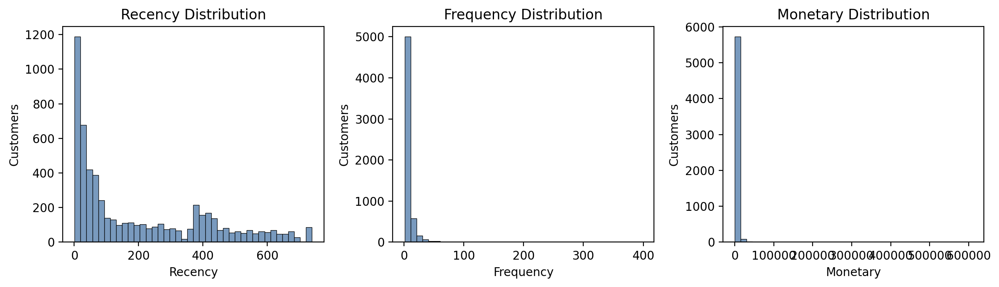
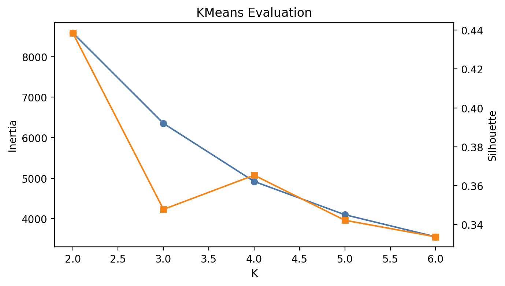
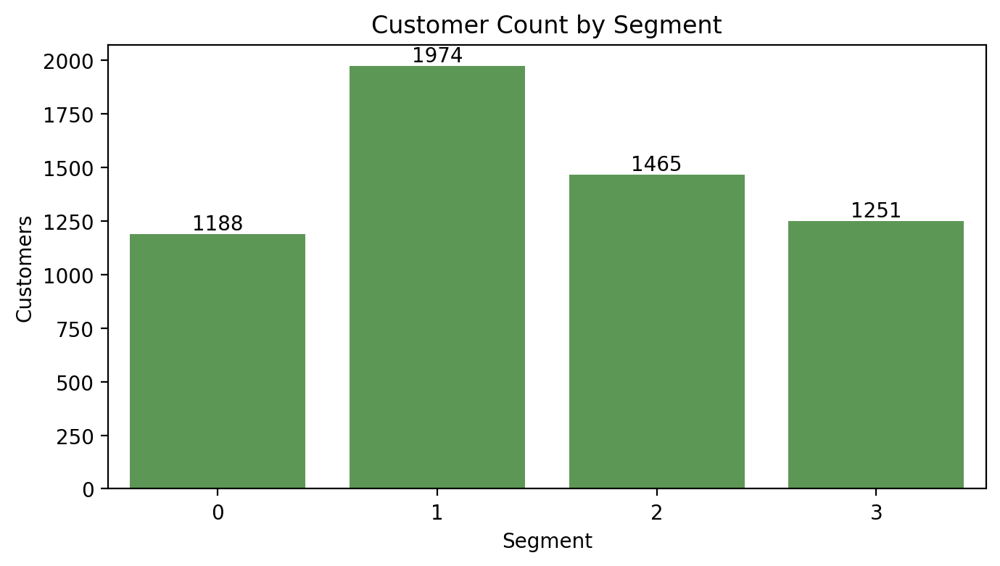
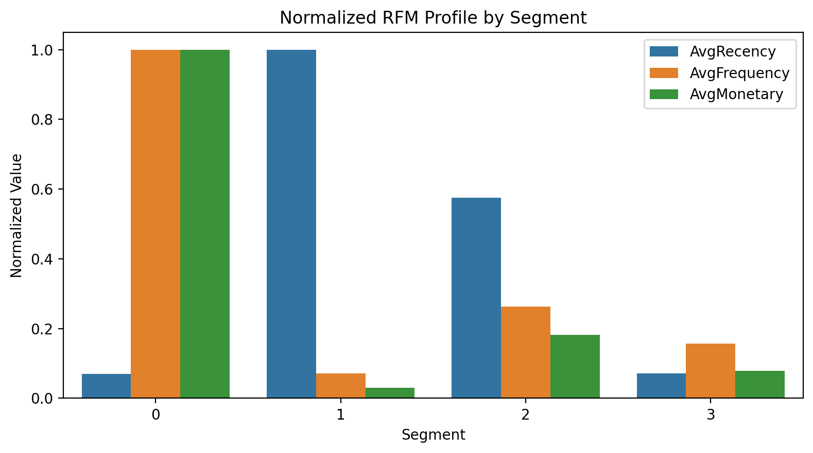
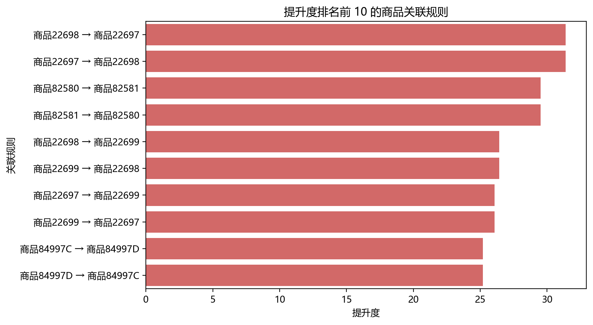

# 电商用户分群与商品关联规则挖掘研究

## 摘要

本文基于 UCI Online Retail II 数据集，对电商零售交易数据进行清洗、用户分群和商品关联规则挖掘。首先去除缺失客户、取消订单、数量和价格异常记录，并构建用户 RFM 特征；然后使用 K-Means 对客户进行聚类，得到高价值活跃客户、沉睡低价值客户、中等价值客户和近期低频客户四类群体；最后基于订单商品篮挖掘二项关联规则，识别商品之间的搭配购买关系。结果表明，RFM + K-Means 能较清楚地区分不同客户价值层次，关联规则可以为商品组合推荐和捆绑销售提供依据。

## 关键词

数据挖掘；电商零售；RFM；K-Means；关联规则

## 一、研究目的

电商平台在日常运营中会积累大量订单数据。单独查看订单明细很难直接判断客户价值，也不容易发现商品之间的共购关系。因此，本文围绕以下两个问题进行分析：

1. 根据客户的购买时间、购买频率和消费金额，将客户划分为不同群体。
2. 根据订单中的商品共现关系，发现适合搭配销售或推荐的商品组合。

## 二、数据集与预处理

本文使用 UCI Online Retail II 数据集，数据文件包含两个工作表：`Year 2009-2010` 和 `Year 2010-2011`。两个工作表共有 1,067,371 条原始记录，字段包括订单号、商品编码、商品描述、购买数量、订单时间、单价、客户编号和国家。

预处理步骤如下：

1. 合并两个年份工作表。
2. 删除客户编号、订单时间、商品编码、购买数量、单价缺失的记录。
3. 删除取消订单，即订单号以 `C` 开头的记录。
4. 保留购买数量和单价都大于 0 的记录。
5. 新增销售金额字段：`Amount = Quantity × Price`。

清洗后得到 805,549 条有效交易记录，覆盖 5,878 名客户、36,969 个订单、4,631 种商品和 41 个国家。订单时间范围为 2009-12-01 07:45:00 至 2011-12-09 12:50:00，总销售金额为 17,743,429.18。交易主要来自 United Kingdom，共 725,250 条记录，其次为 Germany、EIRE、France 和 Netherlands。

## 三、方法

### 3.1 RFM 特征构建

本文使用 RFM 模型描述客户价值：

| 指标 | 含义 | 计算方式 |
| --- | --- | --- |
| Recency | 最近一次消费距统计日期的天数 | 数据最大订单日期后一天减去客户最近订单日期 |
| Frequency | 消费频率 | 客户不同订单数量 |
| Monetary | 消费金额 | 客户所有订单金额之和 |

由于 RFM 指标分布偏斜，聚类前先对三个指标做 `log1p` 变换，再使用标准化处理，减少极端大客户对聚类结果的影响。

### 3.2 K-Means 用户分群

K-Means 使用 RFM 标准化后的特征进行聚类。实验测试 `K=2` 到 `K=6`，使用 Inertia 和 Silhouette 作为参考指标。

| K | Inertia | Silhouette |
| --- | ---: | ---: |
| 2 | 8588.6378 | 0.4387 |
| 3 | 6351.9798 | 0.3478 |
| 4 | 4918.6401 | 0.3653 |
| 5 | 4097.8268 | 0.3421 |
| 6 | 3552.9825 | 0.3336 |

从轮廓系数看，`K=2` 的数值最高，但只能得到较粗的两类客户，业务解释性不足。综合 Inertia 下降趋势和分群可解释性，本文选择 `K=4`。

### 3.3 商品关联规则

关联规则部分以订单为商品篮，先去除邮费、手续费、折扣、平台费用等非普通商品记录，再保留商品数在 2 到 100 之间的订单。最终用于关联规则挖掘的订单数为 33,447。

本文挖掘二项商品关联规则，参数设置为：

| 参数 | 数值 |
| --- | ---: |
| 最小支持度 | 0.015 |
| 最小置信度 | 0.25 |

共得到 146 条关联规则，并按 Lift、Confidence、Support 排序。

## 四、实验结果

### 4.1 用户分群结果

`K=4` 时的客户分群结果如下：

| 分群 | 客户数 | 占比 | 平均Recency | 平均Frequency | 平均Monetary | 群体解释 |
| --- | ---: | ---: | ---: | ---: | ---: | --- |
| 0 | 1188 | 20.21% | 27.43 | 19.34 | 11014.37 | 高价值活跃客户 |
| 1 | 1974 | 33.58% | 395.86 | 1.38 | 325.75 | 沉睡低价值客户 |
| 2 | 1465 | 24.92% | 227.87 | 5.10 | 2002.10 | 中等价值客户 |
| 3 | 1251 | 21.28% | 28.44 | 3.04 | 865.11 | 近期低频客户 |

分群 0 的最近消费时间短、购买频率高、消费金额明显最高，是最重要的核心客户。分群 1 最近消费时间很久、购买频率和金额都低，流失风险较高。分群 2 消费金额和频率处于中等水平，但最近消费时间偏长，需要通过召回活动提升活跃度。分群 3 最近有消费行为，但消费频率和金额较低，适合做新人或低频客户的转化运营。

### 4.2 关联规则结果

Lift 排名前五的规则如下：

| 前项商品 | 后项商品 | Support | Confidence | Lift | Count |
| --- | --- | ---: | ---: | ---: | ---: |
| PINK REGENCY TEACUP AND SAUCER | GREEN REGENCY TEACUP AND SAUCER | 0.0182 | 0.8480 | 31.3742 | 608 |
| GREEN REGENCY TEACUP AND SAUCER | PINK REGENCY TEACUP AND SAUCER | 0.0182 | 0.6726 | 31.3742 | 608 |
| BATHROOM METAL SIGN | TOILET METAL SIGN | 0.0150 | 0.5904 | 29.5161 | 503 |
| TOILET METAL SIGN | BATHROOM METAL SIGN | 0.0150 | 0.7519 | 29.5161 | 503 |
| PINK REGENCY TEACUP AND SAUCER | ROSES REGENCY TEACUP AND SAUCER | 0.0173 | 0.8075 | 26.4281 | 579 |

这些规则的 Lift 都远大于 1，说明商品之间存在明显的共购关系。例如，粉色、绿色、玫瑰图案茶杯碟属于同系列商品，适合组合展示或套装推荐；浴室金属牌和厕所金属牌属于同场景商品，也适合一起推荐。

## 五、运营建议

针对不同客户群体，可以采取以下策略：

| 客户群体 | 建议 |
| --- | --- |
| 高价值活跃客户 | 重点维护，可提供会员权益、提前购、新品推荐和高客单价组合推荐。 |
| 沉睡低价值客户 | 不宜投入过高成本，可使用优惠券、邮件召回等低成本方式测试是否能重新激活。 |
| 中等价值客户 | 具备进一步转化空间，可结合历史购买品类做个性化推荐，提高复购频率。 |
| 近期低频客户 | 最近仍有购买行为，应通过满减、组合购、关联商品推荐提升客单价和购买频率。 |

根据关联规则结果，平台可以将强关联商品放在详情页、购物车页或推荐栏中，也可以将同系列商品做成套装，提高连带购买概率。

## 六、结论

本文完成了对 Online Retail II 数据集的清洗、RFM 特征构建、K-Means 用户分群和商品关联规则挖掘。实验结果显示，客户可以较清楚地分为四类，不同群体在最近消费时间、消费频率和消费金额上差异明显；商品关联规则能够发现同系列、同场景商品之间的强共购关系。整体来看，聚类分析适合用于客户分层，关联规则适合用于商品推荐和组合销售，两者结合可以为电商运营提供较直接的数据依据。
